# 🗳️ Sistema de Eleição SQL

Sistema de banco de dados desenvolvido para simular o gerenciamento de uma eleição, desde o cadastro de partidos, eleitores e candidatos até o registro e a contabilização dos votos.

O projeto foi desenvolvido inicialmente utilizando **MariaDB** e posteriormente implementado também em **PostgreSQL através do Supabase**, permitindo demonstrar o funcionamento do mesmo sistema em diferentes ambientes de banco de dados.

## 🛠️ Tecnologias utilizadas

- SQL
- MariaDB
- PostgreSQL
- Supabase
- GitHub

## 📂 Estrutura do banco de dados

O sistema é composto pelas tabelas:

- `partido`
- `eleitor`
- `candidato`
- `voto`

Foram utilizadas **chaves primárias, chaves estrangeiras, restrições UNIQUE e relacionamentos entre tabelas** para garantir a integridade dos dados.

---

# 🖥️ Implementação no MariaDB

## 1. Estrutura inicial do banco

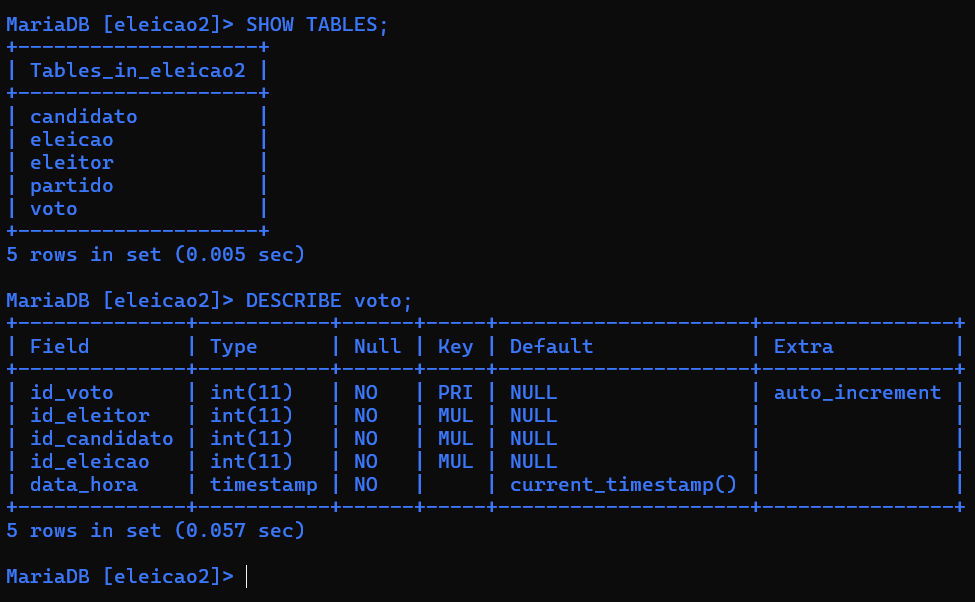

## 2. Partidos cadastrados

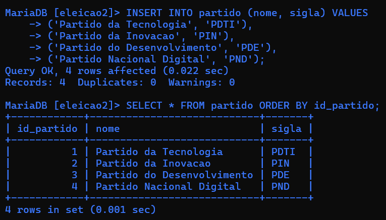

## 3. Eleitores cadastrados

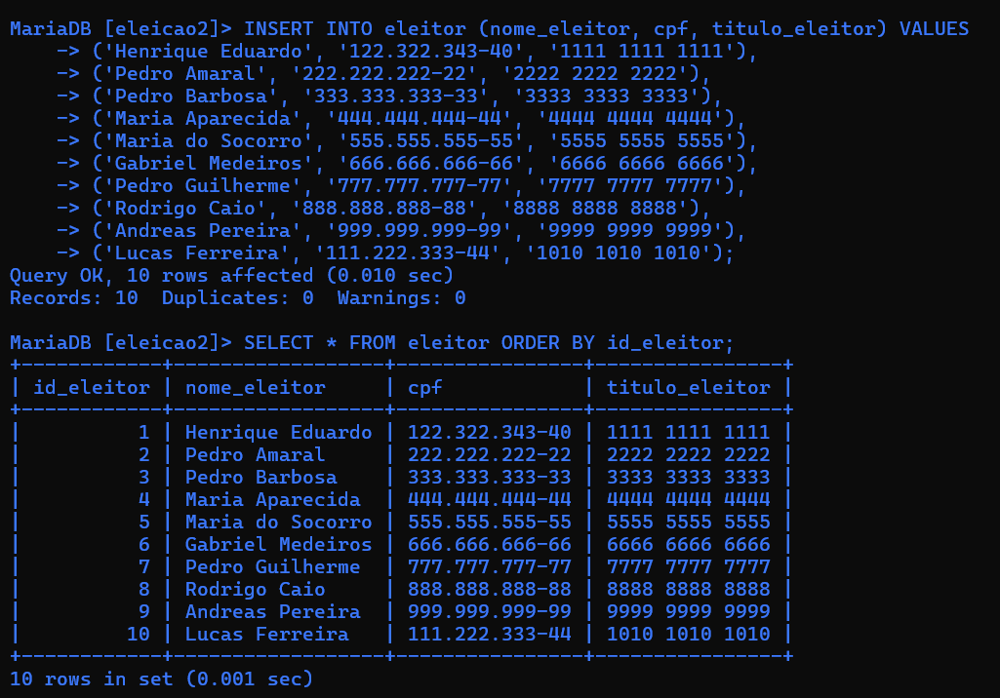

## 4. Candidatos cadastrados

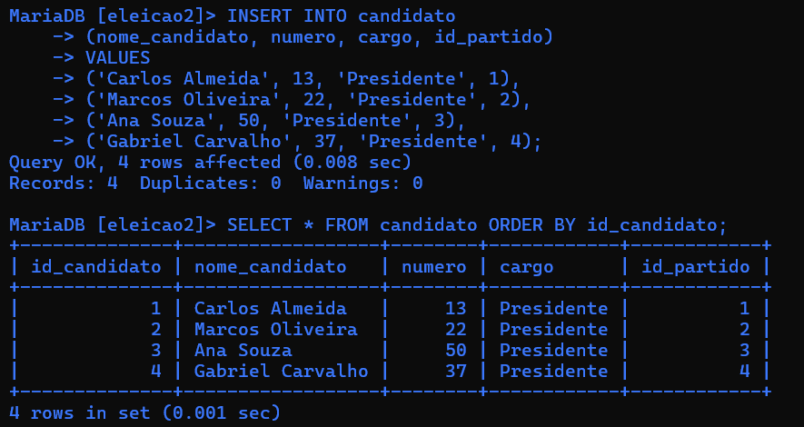

## 5. Eleição cadastrada

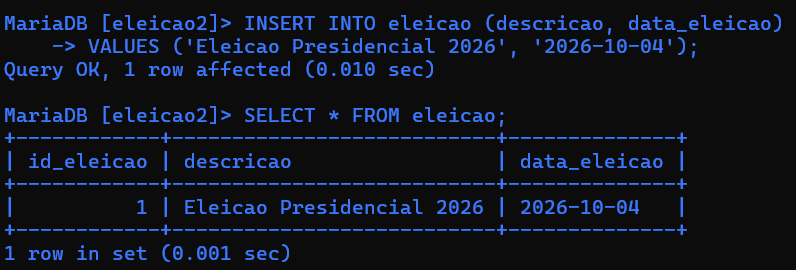

## 6. Registro dos votos

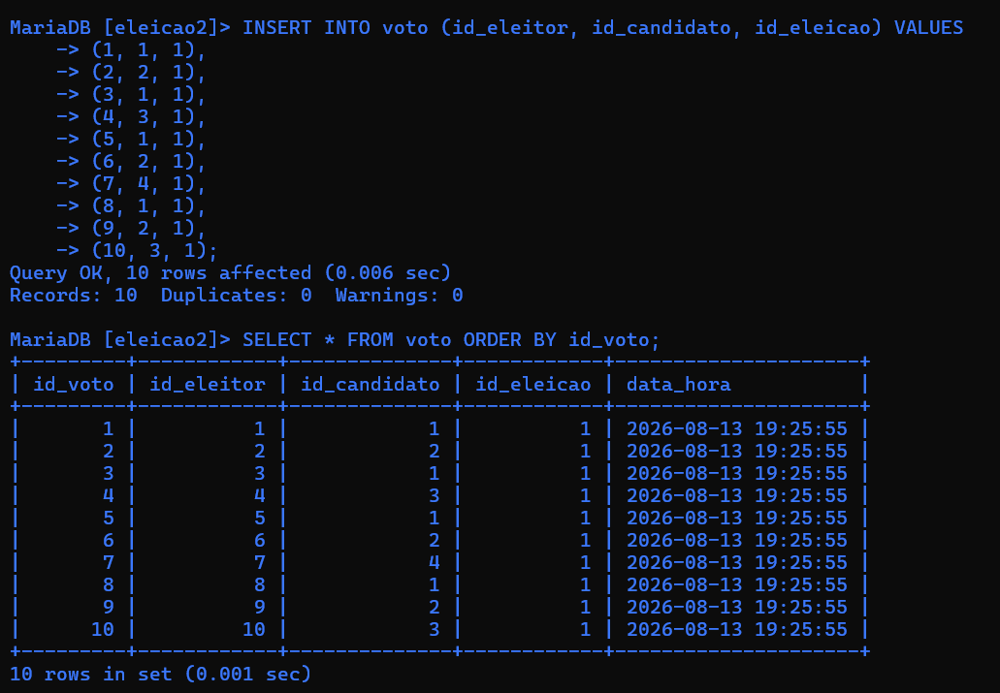

## 7. Regra de voto único

Foi aplicada uma restrição para impedir que um mesmo eleitor registre mais de um voto.

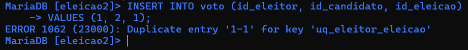

## 8. Consulta com JOIN

Consulta relacionando informações presentes em diferentes tabelas do sistema.

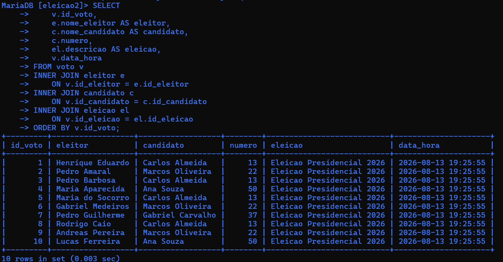

## 9. Ranking da votação

Contabilização dos votos utilizando `COUNT`, `GROUP BY` e `ORDER BY`.

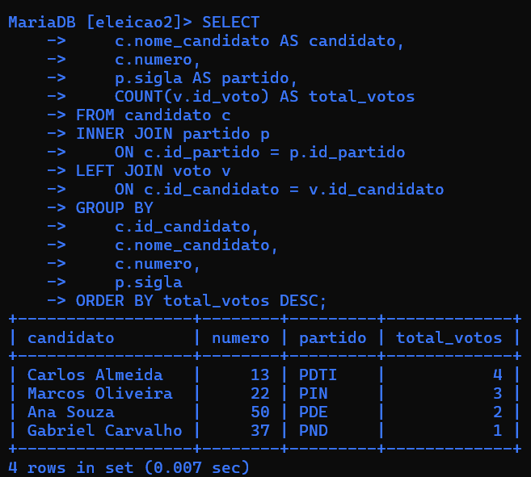

## 10. Estrutura final da tabela de votos

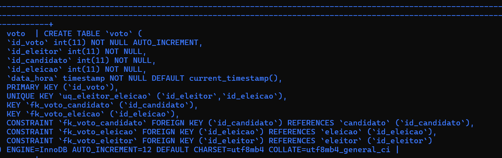

---

# ☁️ Implementação no PostgreSQL — Supabase

Após a implementação no MariaDB, o banco foi recriado no **PostgreSQL utilizando o Supabase**.

## 11. Estrutura do projeto no Supabase

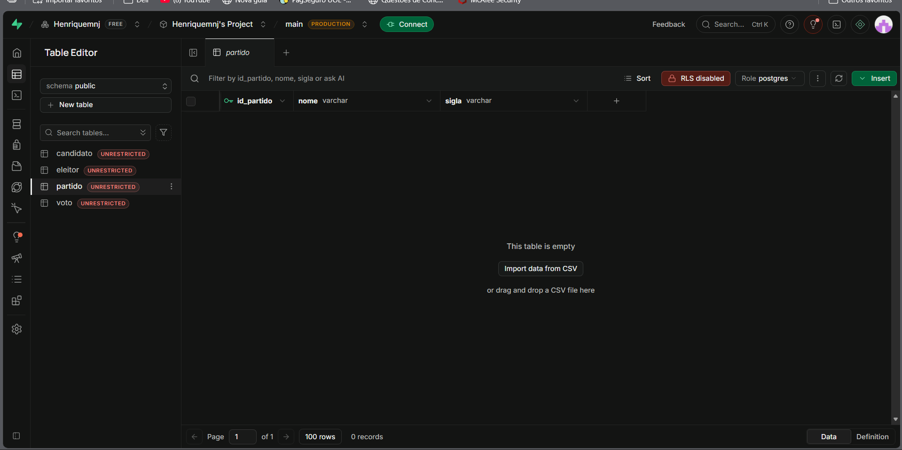

## 12. Cadastro dos partidos

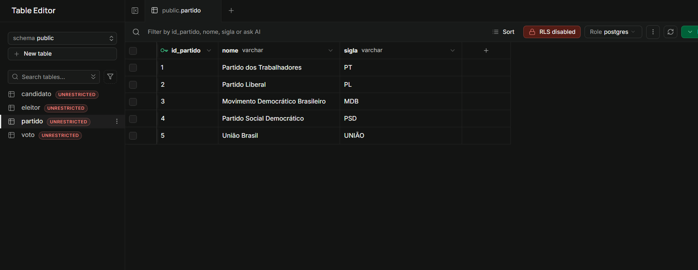

## 13. Inserção dos eleitores

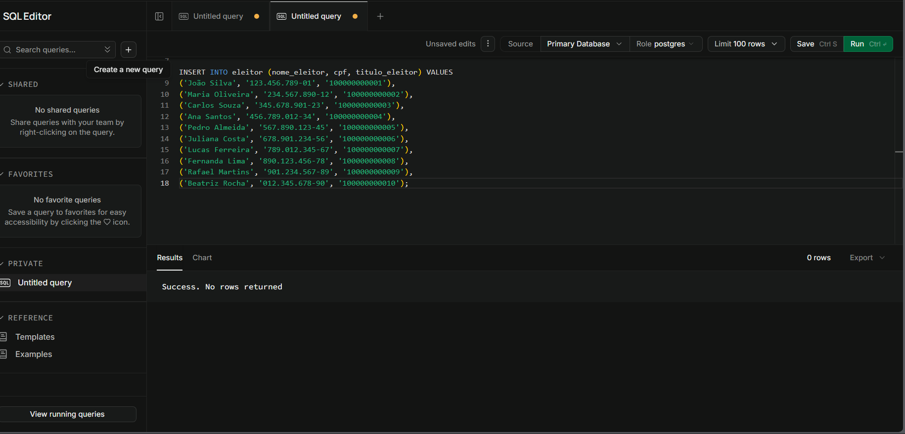

## 14. Registro dos votos

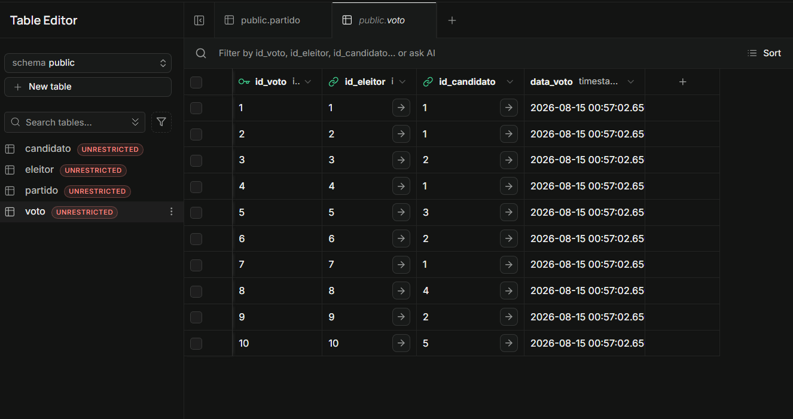

## 15. Consulta relacionando eleitor, candidato e partido

A consulta utiliza `INNER JOIN` para relacionar as tabelas `voto`, `eleitor`, `candidato` e `partido`.

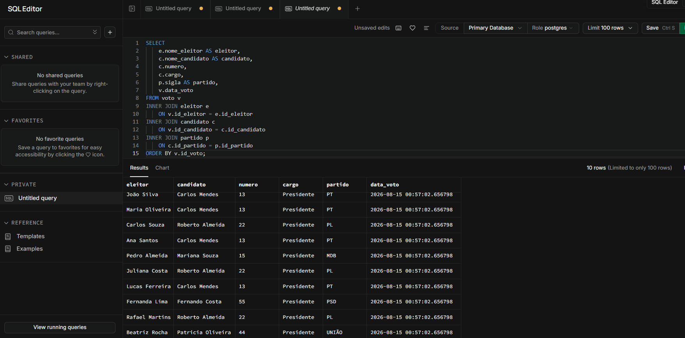

## 16. Total de votos por candidato

Consulta utilizando `LEFT JOIN`, `COUNT`, `GROUP BY` e `ORDER BY` para gerar o ranking dos candidatos.

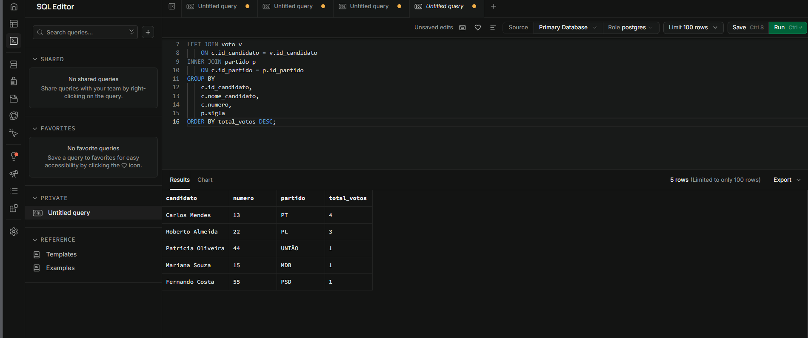

## 17. Visualização gráfica dos resultados

Os resultados da votação também foram visualizados através dos recursos gráficos disponíveis no Supabase.

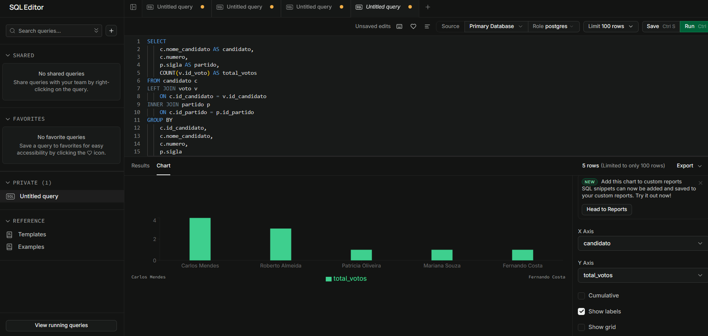

---

# 📁 Arquivos SQL

Os scripts utilizados no projeto estão disponíveis na pasta [`sql`](sql/):

- `01_criacao_tabelas.sql` — criação das tabelas e relacionamentos.
- `02_insercao_dados.sql` — inserção dos partidos, eleitores, candidatos e votos.
- `03_consultas.sql` — consultas utilizando JOIN, agregação e contabilização dos votos.

## 🎯 Conceitos aplicados

Durante o desenvolvimento foram aplicados conceitos de:

- Modelagem de banco de dados
- DDL e DML
- Primary Keys e Foreign Keys
- Constraints
- `UNIQUE`
- `INSERT`
- `SELECT`
- `INNER JOIN`
- `LEFT JOIN`
- `COUNT`
- `GROUP BY`
- `ORDER BY`
- Integridade referencial
- Migração entre MariaDB e PostgreSQL

---

## 👨‍💻 Autor

**Henrique Santos**

Estudante de Análise e Desenvolvimento de Sistemas.
